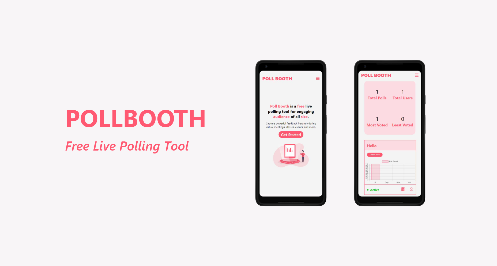

# Poll Booth
Poll Booth is a free live polling tool for engaging audience of all size. Capture powerful feedback instantly during virtual meetings, classes, events, and more.


## Live
<pre><a href="https://pollbooth.herokuapp.com/">https://pollbooth.herokuapp.com/</a></pre>

## Set up

##### Clone the repository

```bash
git clone https://github.com/SaranshDawra/Live-Polling.git
```

##### Move to the desired folder

```bash
cd Live-Polling
```

##### Set Environment Variables

* Create a `.env` file and add the following

```bash
MONGODB_URI=Your MongoDB URL
```

##### Install Dependencies

```bash
npm install
cd client
npm install
```

##### Run

```bash
# Run frontend (:3000) & backend (:5000)
npm run dev

# Run frontend
npm run client

# Run backend
npm run server
```

[](https://www.linkedin.com/in/saranshdawra/)